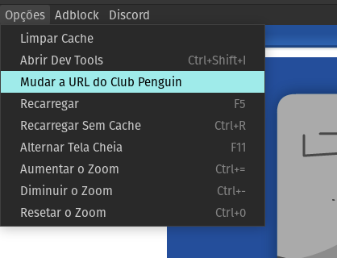
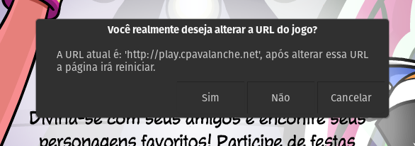
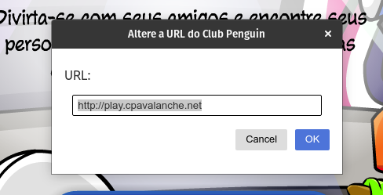
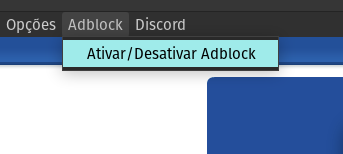
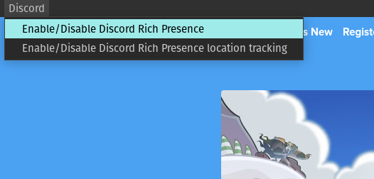
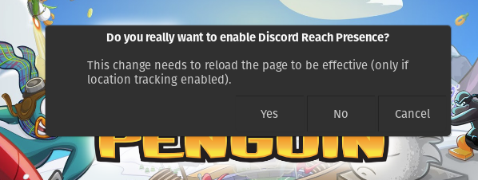
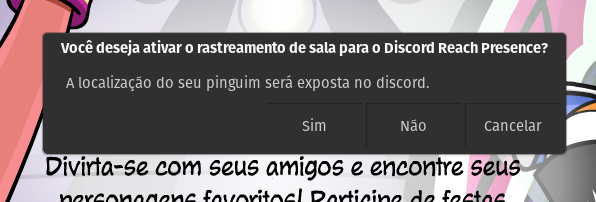
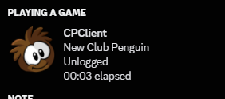
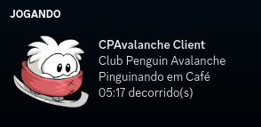

# CPClient

An alternative Club Penguin Client for any Club Penguin Private Server

## Installation

The installers are available from [releases](https://github.com/renanrcp/CPClient/releases).

OBS: macOS installer not available for now.

## Features
- URL setter for change to any CPPS the user want.
- Clear cache option
- Reload and Reload Without Cache
- Can set FullScreen
- Can change the zoom with `CmdOrControl +`, `CmdOrControl -` and `CmdOrContrl + 0`
- Can open Chromium Dev Tools
- Optional AD Blocker for performance gameplay (comes disabled)
- Optional Discord Rich Presence (comes disabled)
- Optional Discord Rich Presence Location Tracking (comes disabled)

#### URL Setter
You can change the url of the CPPS and play in any other CPPS

 

 

Know CPPS available:
- [New Club Penguin](https://newcp.net) (default)
- [Club Penguin Brasil](https://cpbrasil.pw/)
- [Super Club Penguin](https://supercpps.com)
- [Aventure Pingouin](https://aventurepingouin.com)

#### Ad Blocker
You can enable/disable an Ad Blocker when you want a performatic gameplay (comes disabled by default).

OBS: The CPPS devs needs money to keep the game alive, only use this when you need a performatic gameplay.

 

#### Discord Rich Presense (with location tracking)
The client supports Discord RPC (comes disabled by default).

The client also supports share your penguin location in the Discord RPC (also comes disabled by default), you can use the Discord RPC with or without the location tracking.

OBS: The location tracker MAY work in an AS3 CPPS.

The location tracker also supports the CPPS localization but don't support RPC phrases localization, the supported languages are: (EN/PT).

 

 

 

 

### License
This project uses the [MIT License](https://github.com/renanrcp/CPClient/blob/main/LICENSE).